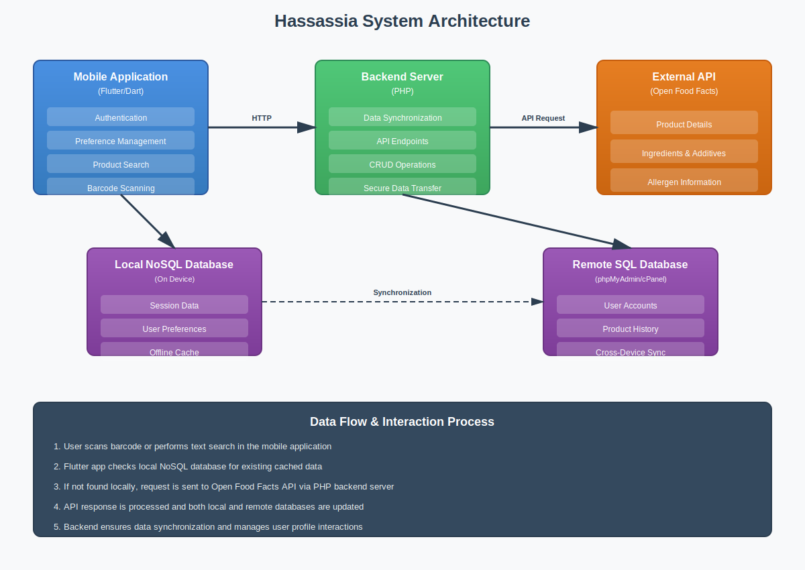
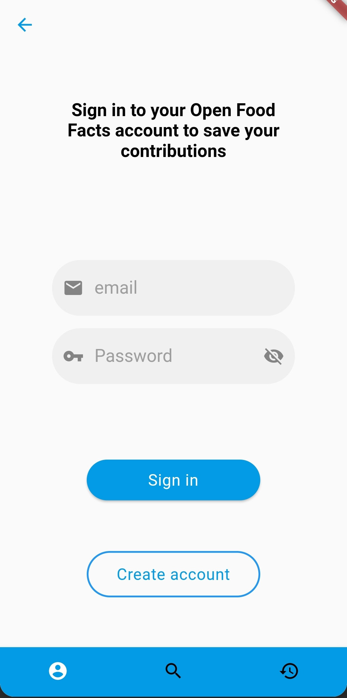
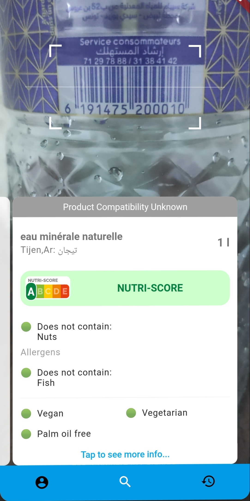
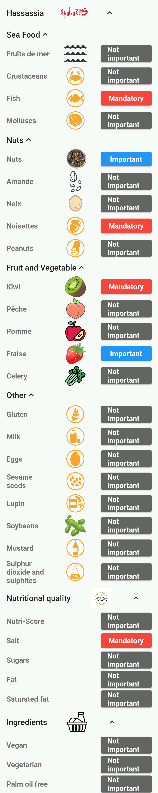
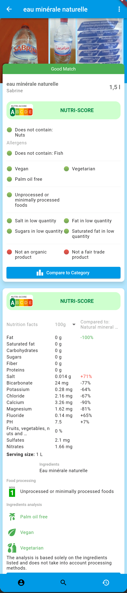
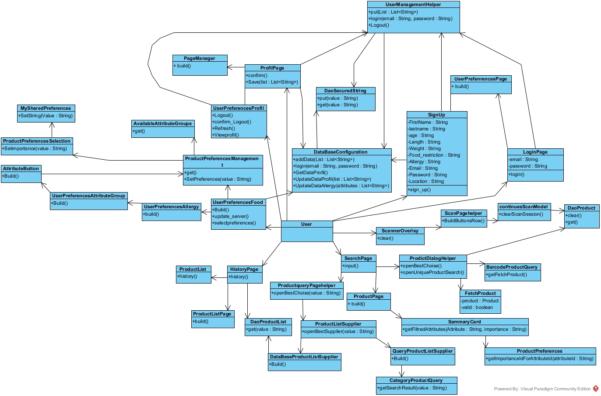

# 🥗 Hassassia – Food Recommendation Mobile App

<p align="center">
  
</p>

> A smart food recommendation Flutter app designed to help users with allergies and dietary restrictions make safe, healthy choices.

---

## 📱 Overview

**Hassassia** is a mobile application built using **Flutter** that helps users identify safe food products by scanning barcodes or searching by text.  
It’s especially designed for people with food allergies, dietary preferences, or those who simply want to eat healthier.

The app connects to the **Open Food Facts API** and includes both **local and remote databases** to provide an intelligent, personalized experience — even offline.

---

## 🚀 Features

| Category | Description |
|-----------|-------------|
| 🔍 **Barcode Scanner** | Instantly scan a food product and view detailed nutritional and allergen information. |
| 🧠 **Smart Search** | Search by product name or brand, personalized based on allergies and preferences. |
| ❤️ **Personalized Preferences** | Define your dietary preferences: ingredients to avoid or prioritize. |
| 🧾 **Product Matching** | Automatic color-coded feedback — green ✅ (safe), red ❌ (unsafe), gray ⚪ (unknown). |
| 🗂️ **History Tracking** | Access your search and scan history anytime. |
| 🗄️ **Dual Database** | Local storage for offline access + remote database synchronization. |
| 🧬 **Future-ready** | Designed for future integration of AI-based recommendation features. |

---

## 🧩 System Architecture

<p align="center">
  
</p>

**Architecture Overview**
- **Frontend:** Flutter (Dart)
- **Backend:** PHP + MySQL (hosted via cPanel)
- **API:** Open Food Facts API
- **Database Types:** Local NoSQL + Remote SQL
- **IDE:** Visual Studio Code

---

## 🧰 Tech Stack

| Layer | Technology |
|-------|-------------|
| **Frontend** | Flutter (Dart) |
| **Backend** | PHP |
| **Database** | NoSQL (local) + MySQL (remote via phpMyAdmin) |
| **API** | Open Food Facts |
| **IDE** | Visual Studio Code |

---

## 🧠 Methodology

The app was developed following the **Waterfall Model**, with the following key stages:
1. **Requirement Analysis**  
2. **Design (UML, Class & Sequence Diagrams)**  
3. **Implementation (Flutter + PHP)**  
4. **Verification & Testing**  
5. **Maintenance & Improvements**

---

## 🧪 Testing & Validation

| Module | Test Objective |
|--------|----------------|
| Sign In | Validate login process |
| Sign Up | Ensure account creation works |
| Barcode Scan | Verify correct product identification |
| Text Search | Confirm accurate product lookup |
| Food Preferences | Check allergen-based filtering |

---

## 📸 App Screenshots

<p align="center">
  
  
</p>
<p align="center">
  
  
</p>
---

## 🧾 UML & Diagrams

- **Class Diagram**

<p align="center">
  
</p>

---

## 🏢 Project Context

This project was developed during my **Bachelor’s in Computer Science (2021–2022)**  
at the **Higher Institute of Computer Science and Management Kairouan(ISIGK)**, in collaboration with **Compi Technology**.


---

## 💡 Problem & Motivation

People with food allergies face challenges when shopping — reading small labels, identifying hidden ingredients, or dealing with language barriers.  
Hassassia solves this by providing **instant, personalized information** via barcode scanning and smart matching algorithms.

---

## 🌍 Future Improvements

- 🤖 Integration of **Machine Learning** for personalized food recommendations.  
- 🥗 Nutritional tracking for athletes and people following diets.  
- 📡 Cloud synchronization with advanced analytics.

---

## ⚙️ Installation

### Prerequisites
- Flutter SDK installed ([Flutter setup guide](https://flutter.dev/docs/get-started/install))
- Android Studio or VS Code
- Emulator or connected device

### Steps
```bash
# Clone the repository
git clone https://github.com/yourusername/hassassia.git

# Navigate to project folder
cd hassassia

# Install dependencies
flutter pub get

# Run the app
flutter run


## 🧾 License
This project is licensed under the **MIT License** — see the [LICENSE](./LICENSE) file for details.
